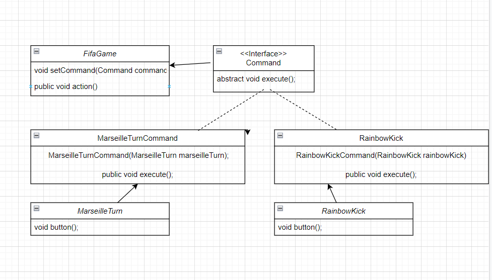

커맨드 패턴(Command Pattern)
=========================
#### 커맨드 패턴이란?
요청을 객체의 형태로 캡슐화,
사용자가 보낸 요청을 나중에 이용할 수 있돌 메서드 이름, 매게변수 등 요청에 필요한 정보를
저장 또는 로깅 취소할 수 있게 하는 패턴이다.

#### 예제
제가 주로 즐기는 FIFA라는 게임을 에제로 했습니다.
<ul>
<li>
메인클래스(main class)
Command_main
</li>
<li>
인터페이스(Interface)
Command
</li>
<li>
클래스(Class) 
FifaGame 
RainbowKickCommandbow 
RainbowKickCommand  < Command 
MarseilleTurn 
MarseilleTurnCommand <-Command 
</li>
</ul>

<ul>
<li>
게이머 [Client]
게임에 스킬을 명령한다. 
</li>
<li>
게임 [Invoker]
명령한 스킬을 기술에 전달한다. 
</li>
<li>
기술 [Recevier]
요청 받은 기능을 수힝핸다. 
</li>
<li>
명령(Command)
어떤 명령을 할 것인지에 대한 정보가 있다. 
</li>
</ul>

 
Skill

	RainbowKick
	MarseilleTurn

